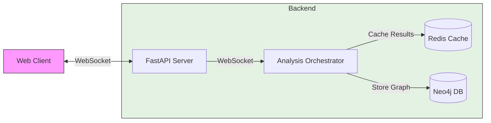

Let me create a system architecture diagram and documentation for this real-time graph processing system.


# Real-time Graph Processing System Documentation

## System Overview
A distributed system for real-time graph processing with client reconnection support.

## Key Components

1. **Analysis Orchestrator**
   - Manages long-running graph analysis jobs
   - Handles client connections/disconnections
   - Caches intermediate results in Redis
   - Broadcasts updates to connected clients

2. **Caching Layer**
   - Uses Redis for temporary storage
   - Caches analysis batches with TTL
   - Enables efficient data replay on reconnection
   - Sequence-based retrieval of missed updates

3. **Client Connection Management**
   ```python
   Key flows:
   1. New connection -> Send cached data -> Stream live updates
   2. Disconnection -> Maintain job -> Cache updates
   3. Reconnection -> Replay from sequence -> Resume streaming
   ```

## Data Flow
1. Client initiates WebSocket connection with sequence number
2. Server retrieves cached data from sequence
3. Analysis continues independently of client state
4. All updates cached in Redis with TTL
5. Neo4j stores final graph state

## Key Features
- Stateless server design
- Fault-tolerant processing
- Efficient reconnection handling
- Scalable multi-client support

## Usage
```python
ws = await websocket.connect("/stream/{job_id}?from_sequence={seq}")
```
